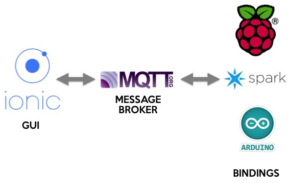

# Home.Pi 

* Simple Home Automation Solution with MQTT

[Demo Application](https://homepi.firebaseapp.com/)

## Features

* Home Automation with MQTT
* Completely independent from the used technology (most bindings are actually written in node.js)
* Cloud-based architecture (only the bindings to control the devices are running locally)

## System Architecture

## Installation

* Install a MQTT Broker with Websocket Support, e.g. 
	* [HiveMQ](http://www.hivemq.com/)
	* [Mosquitto](http://mosquitto.org/) with [https://github.com/stylpen/WSS]
	* [Mosca](http://www.mosca.io/)

* Clone the repository and install the dependencies

	git clone https://github.com/denschu/homepi
	npm install

* Open app/js/config.js and add your Firebase URL

* Create a Firebase Account

* Place you device configuration in a configuration file e.g. "firebase-config.json" and upload it to your firebase account. See also the example "firebase-config-example.json" for further details.

Example:

	{
	    "type" : "on_off",
	    "value" : false,
	    "name" : "Ceiling Light",
	    "topic" : "/home/devices/livingroom/ceiling_light/value",
	    "id" : "ceiling_light"
  	}

* Build and Run

	grunt serve

or run it with Docker without installation

	docker run -d -e BACKEND_URL=homepi -p 80:80 denschu/homepi
	
## MQTT topic conventions

Subscribe to a topic for getting the value of a device

	/home/devices/<room>/<device-name>/state 
	/home/devices/living_room/light1/state

Publish to a topic for setting the value of a device

	/home/devices/<room>/<device-name>/state/set <value>
	/home/devices/living_room/light1/state/set true

## Available MQTT Bindings (separate git-Repositories)

Take a look at my [puppet manifests](https://github.com/denschu/homepi-puppet) to setup the Raspberry Pi very easily with puppet. You also get some help for the manual setup.

At the moment the following "experimental" MQTT bindings are available:

* [mqtt-exec](https://npmjs.org/package/mqtt-exec) Execute shell commands like "sudo shutdown -h now"
* [mqtt-zway](https://npmjs.org/package/mqtt-zway) Connect to the Z-Wave RaZBerry Server Z-Way
* [mqtt-google-calendar](https://npmjs.org/package/mqtt-google-calendar) Use Google Calendar as a scheduling engine
* [mqtt-rules](https://github.com/denschu/mqtt-rules) Create rules and execute them on incoming MQTT messages
* [mqtt-temperature](https://github.com/denschu/mqtt-temperature) Log temperature to MQTT
* [mqtt-lirc](https://github.com/denschu/mqtt-lirc) Control infrared devices

## Technologies/Frameworks

* node.js
* Express (HTTP/Web Server)
* MQTT
* Ionic Framework (with AngularJS)

For further informations and setup instructions please refer to my [blog posts](http://blog.codecentric.de/en/). 